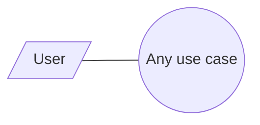

# Access control

- **Diagram Type**: Use Case
- **Package**: HomerSelect/BSL/Analysis Model/COMMON for BSL/Access control/Use Case
- **Diagram ID**: 132901
- **Elements**: 2
- **Connectors**: 1

```mermaid
graph LR
    User[/"User"/]
    Any_use_case(("Any use case"))
    User --- Any_use_case
```
