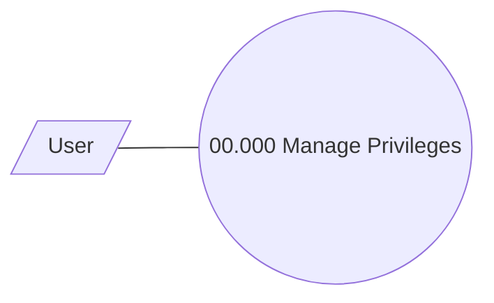

# Manage Privileges

- **Diagram Type**: Use Case
- **Package**: HomerSelect/BSL/Analysis Model/COMMON for BSL/Access control/Use Case
- **Diagram ID**: 132903
- **Elements**: 2
- **Connectors**: 1

