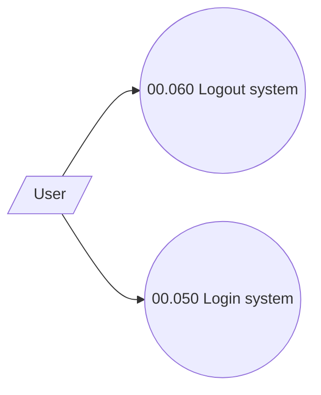

# System login

- **Diagram Type**: Use Case
- **Package**: HomerSelect/BSL/Analysis Model/COMMON for BSL/Access control/Use Case
- **Diagram ID**: 132902
- **Elements**: 3
- **Connectors**: 2

```mermaid
graph LR
    n_00_060_Logout_system(("00.060 Logout system"))
    n_00_050_Login_system(("00.050 Login system"))
    User[/"User"/]
    User --> n_00_060_Logout_system
    User --> n_00_050_Login_system
```
