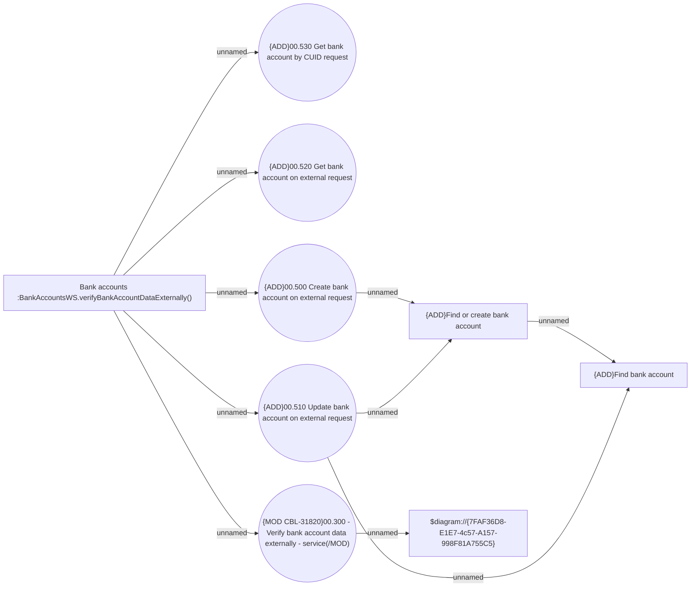

# BankAccountWS operations - use case model

- **Diagram Type**: Use Case
- **Package**: HomerSelect/BSL/Analysis Model/COMMON for BSL/Bank Account Management/UseCase Model
- **Diagram ID**: 164321
- **Elements**: 9
- **Connectors**: 10

