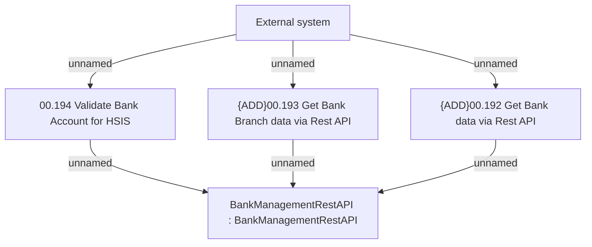

# Bank Management Rest API

```mermaid
graph TD
    n_00_194_Validate_Bank_Account_for_HSIS["00.194 Validate Bank Account for HSIS"]
    External_system["External system"]
    BankManagementRestAPI_BankManagementRestAPI["BankManagementRestAPI : BankManagementRestAPI"]
    ADD_00_192_Get_Bank_data_via_Rest_API["{ADD}00.192 Get Bank data via Rest API"]
    ADD_00_193_Get_Bank_Branch_data_via_Rest_API["{ADD}00.193 Get Bank Branch data via Rest API"]
    External_system -->|unnamed| ADD_00_192_Get_Bank_data_via_Rest_API
    External_system -->|unnamed| ADD_00_193_Get_Bank_Branch_data_via_Rest_API
    External_system -->|unnamed| n_00_194_Validate_Bank_Account_for_HSIS
    n_00_194_Validate_Bank_Account_for_HSIS -->|unnamed| BankManagementRestAPI_BankManagementRestAPI
    ADD_00_193_Get_Bank_Branch_data_via_Rest_API -->|unnamed| BankManagementRestAPI_BankManagementRestAPI
    ADD_00_192_Get_Bank_data_via_Rest_API -->|unnamed| BankManagementRestAPI_BankManagementRestAPI
```
