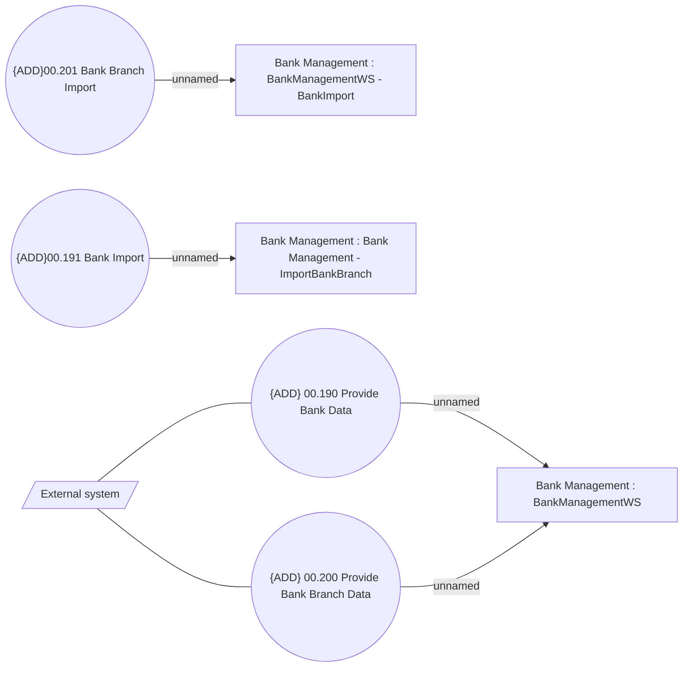

# Synchronization

- **Diagram Type**: Use Case
- **Package**: HomerSelect/BSL/Analysis Model/COMMON for BSL/Bank Management/Synchronization/Use Case
- **Diagram ID**: 162676
- **Elements**: 8
- **Connectors**: 6

