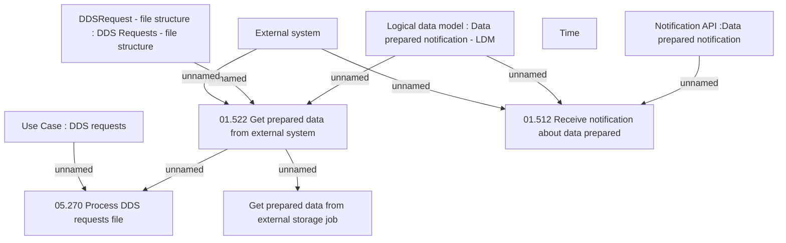

# Data prepared notification - UC model

```mermaid
graph TD
    DDSRequest_file_structure_DDS_Requests_file_structure["DDSRequest - file structure : DDS Requests - file structure"]
    Use_Case_DDS_requests["Use Case : DDS requests"]
    n_05_270_Process_DDS_requests_file["05.270 Process DDS requests file"]
    Logical_data_model_Data_prepared_notification_LDM["Logical data model : Data prepared notification - LDM"]
    Get_prepared_data_from_external_storage_job["Get prepared data from external storage job"]
    Notification_API_Data_prepared_notification["Notification API :Data prepared notification"]
    Time["Time"]
    n_01_522_Get_prepared_data_from_external_system["01.522 Get prepared data from external system"]
    External_system["External system"]
    n_01_512_Receive_notification_about_data_prepared["01.512 Receive notification about data prepared"]
    n_01_522_Get_prepared_data_from_external_system -->|unnamed| n_05_270_Process_DDS_requests_file
    n_01_522_Get_prepared_data_from_external_system -->|unnamed| Get_prepared_data_from_external_storage_job
    Notification_API_Data_prepared_notification -->|unnamed| n_01_512_Receive_notification_about_data_prepared
    Logical_data_model_Data_prepared_notification_LDM -->|unnamed| n_01_522_Get_prepared_data_from_external_system
    Logical_data_model_Data_prepared_notification_LDM -->|unnamed| n_01_512_Receive_notification_about_data_prepared
    Use_Case_DDS_requests -->|unnamed| n_05_270_Process_DDS_requests_file
    DDSRequest_file_structure_DDS_Requests_file_structure -->|unnamed| n_01_522_Get_prepared_data_from_external_system
    External_system -->|unnamed| n_01_512_Receive_notification_about_data_prepared
    External_system -->|unnamed| n_01_522_Get_prepared_data_from_external_system
```
