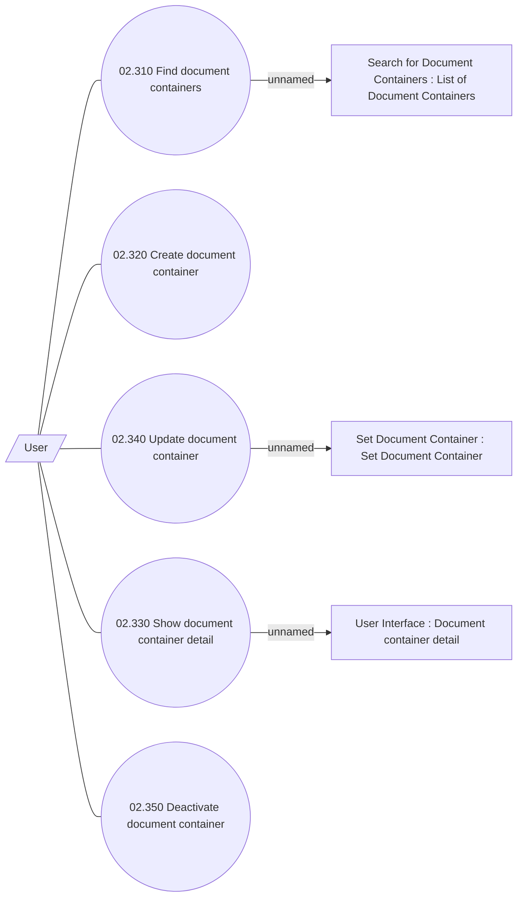

# Manage Container

- **Diagram Type**: Use Case
- **Package**: HomerSelect/BSL/Analysis Model/COMMON for BSL/Document/Document Container/Use Case
- **Diagram ID**: 67953
- **Elements**: 9
- **Connectors**: 8

