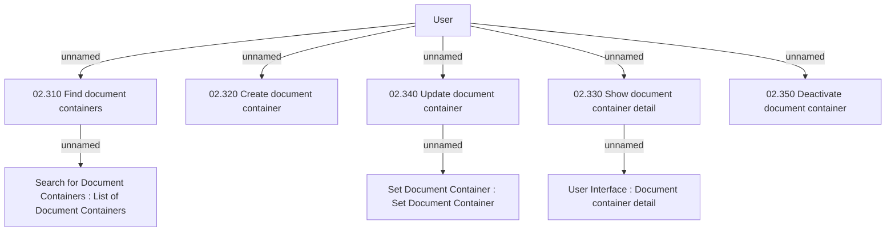

# Manage Container

```mermaid
graph TD
    n_02_310_Find_document_containers["02.310 Find document containers"]
    User_Interface_Document_container_detail["User Interface : Document container detail"]
    n_02_320_Create_document_container["02.320 Create document container"]
    n_02_330_Show_document_container_detail["02.330 Show document container detail"]
    Search_for_Document_Containers_List_of_Document_Containers["Search for Document Containers : List of Document Containers"]
    Set_Document_Container_Set_Document_Container["Set Document Container : Set Document Container"]
    n_02_340_Update_document_container["02.340 Update document container"]
    n_02_350_Deactivate_document_container["02.350 Deactivate document container"]
    User["User"]
    n_02_340_Update_document_container -->|unnamed| Set_Document_Container_Set_Document_Container
    n_02_310_Find_document_containers -->|unnamed| Search_for_Document_Containers_List_of_Document_Containers
    n_02_330_Show_document_container_detail -->|unnamed| User_Interface_Document_container_detail
    User -->|unnamed| n_02_310_Find_document_containers
    User -->|unnamed| n_02_350_Deactivate_document_container
    User -->|unnamed| n_02_340_Update_document_container
    User -->|unnamed| n_02_320_Create_document_container
    User -->|unnamed| n_02_330_Show_document_container_detail
```
