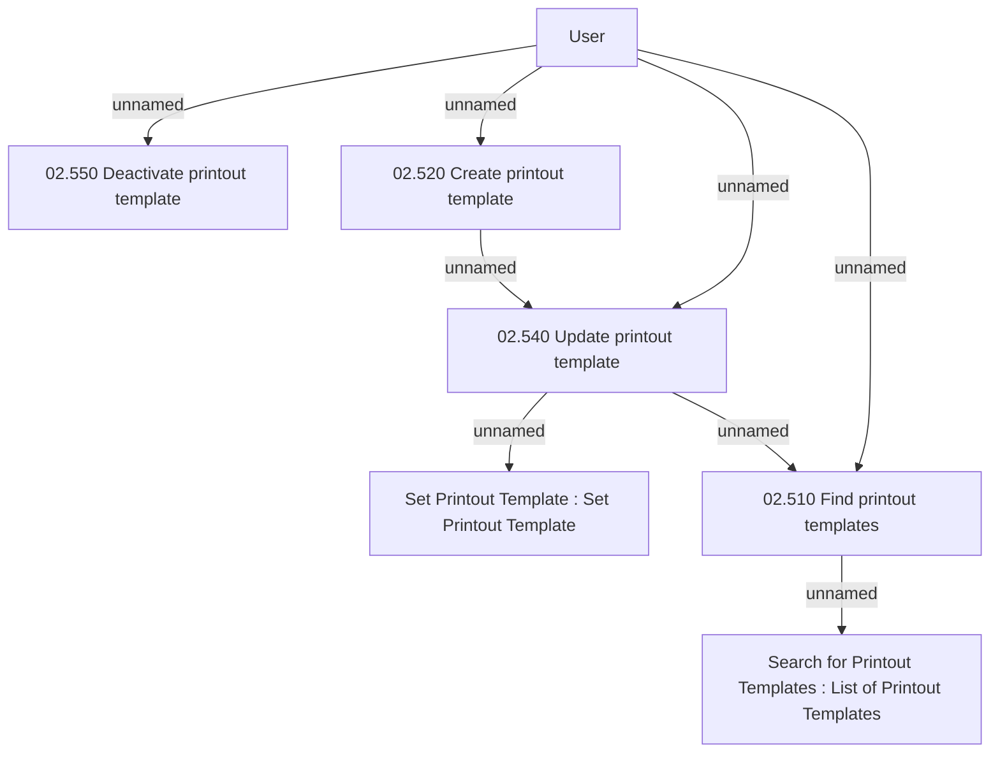

# Manage Printout Templates

```mermaid
graph TD
    n_02_550_Deactivate_printout_template["02.550 Deactivate printout template"]
    Search_for_Printout_Templates_List_of_Printout_Templates["Search for Printout Templates : List of Printout Templates"]
    Set_Printout_Template_Set_Printout_Template["Set Printout Template : Set Printout Template"]
    n_02_520_Create_printout_template["02.520 Create printout template"]
    n_02_540_Update_printout_template["02.540 Update printout template"]
    n_02_510_Find_printout_templates["02.510 Find printout templates"]
    User["User"]
    n_02_540_Update_printout_template -->|unnamed| n_02_510_Find_printout_templates
    n_02_520_Create_printout_template -->|unnamed| n_02_540_Update_printout_template
    n_02_540_Update_printout_template -->|unnamed| Set_Printout_Template_Set_Printout_Template
    n_02_510_Find_printout_templates -->|unnamed| Search_for_Printout_Templates_List_of_Printout_Templates
    User -->|unnamed| n_02_540_Update_printout_template
    User -->|unnamed| n_02_550_Deactivate_printout_template
    User -->|unnamed| n_02_510_Find_printout_templates
    User -->|unnamed| n_02_520_Create_printout_template
```
