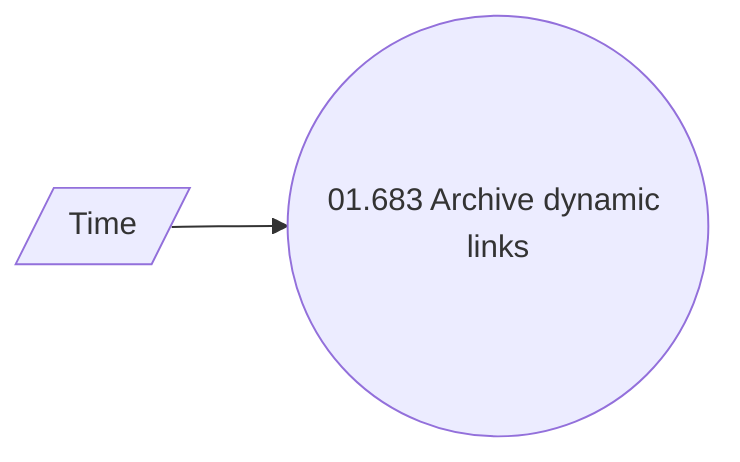

# Use Case model

- **Diagram Type**: Use Case
- **Package**: HomerSelect/BSL/Analysis Model/COMMON for BSL/Dynamic link/UseCase model
- **Diagram ID**: 121030
- **Elements**: 2
- **Connectors**: 1

