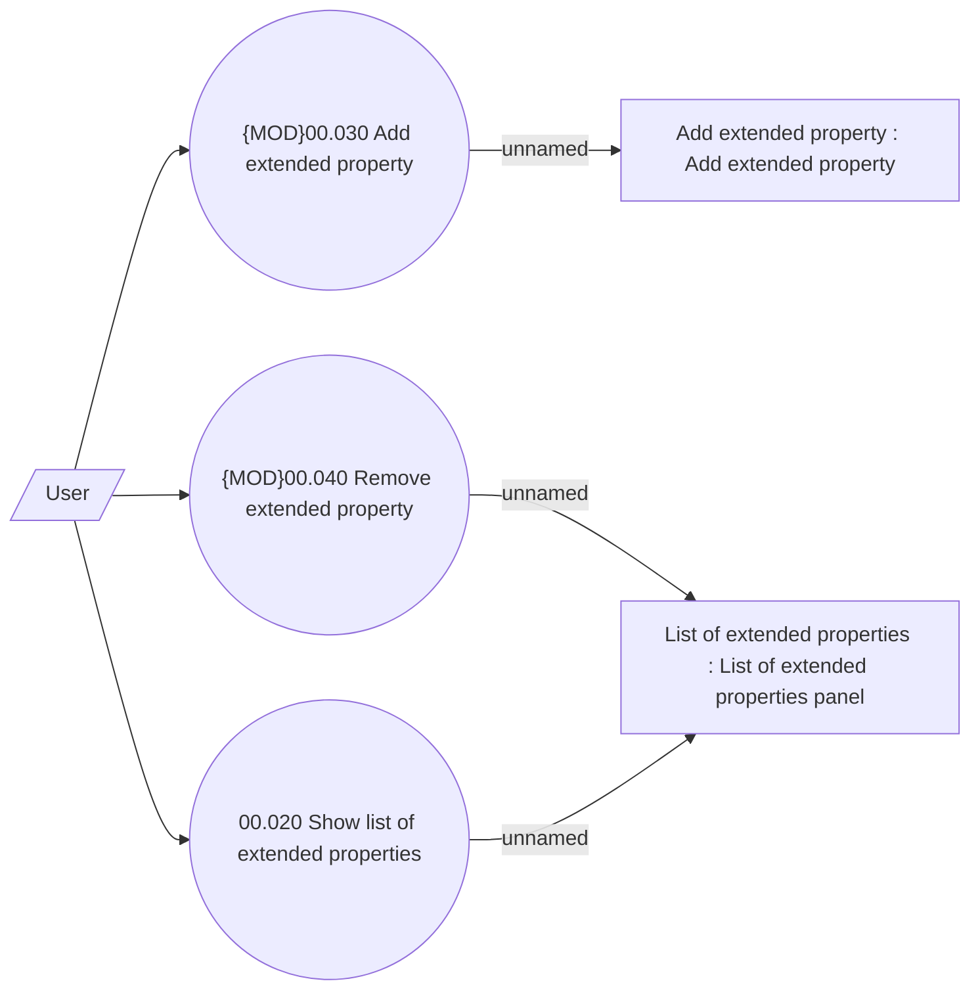

# Extended properties

- **Diagram Type**: Use Case
- **Package**: HomerSelect/BSL/Analysis Model/COMMON for BSL/Extended properties/Use Case
- **Diagram ID**: 164530
- **Elements**: 6
- **Connectors**: 6

