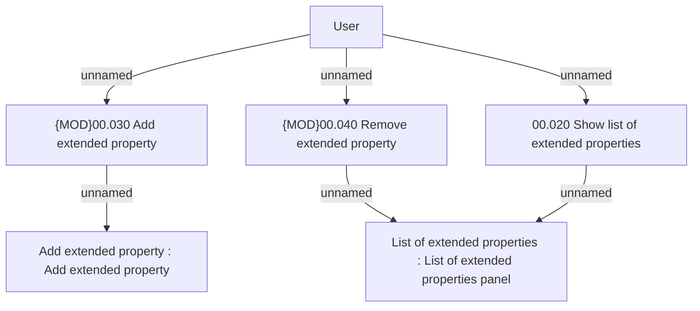

# Extended properties

```mermaid
graph TD
    Add_extended_property_Add_extended_property["Add extended property : Add extended property"]
    List_of_extended_properties_List_of_extended_properties_pane["List of extended properties : List of extended properties panel"]
    User["User"]
    MOD_00_040_Remove_extended_property["{MOD}00.040 Remove extended property"]
    MOD_00_030_Add_extended_property["{MOD}00.030 Add extended property"]
    n_00_020_Show_list_of_extended_properties["00.020 Show list of extended properties"]
    MOD_00_040_Remove_extended_property -->|unnamed| List_of_extended_properties_List_of_extended_properties_pane
    n_00_020_Show_list_of_extended_properties -->|unnamed| List_of_extended_properties_List_of_extended_properties_pane
    MOD_00_030_Add_extended_property -->|unnamed| Add_extended_property_Add_extended_property
    User -->|unnamed| MOD_00_030_Add_extended_property
    User -->|unnamed| MOD_00_040_Remove_extended_property
    User -->|unnamed| n_00_020_Show_list_of_extended_properties
```
