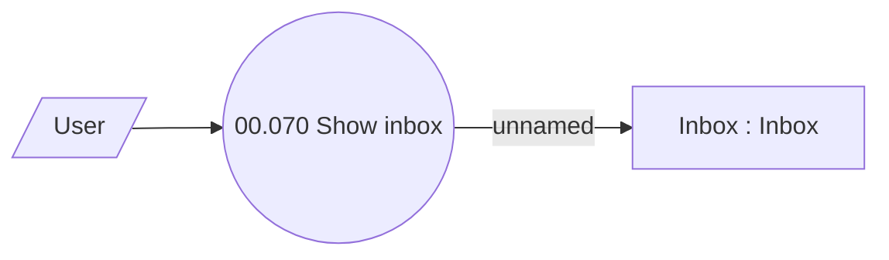

# System notifications

- **Diagram Type**: Use Case
- **Package**: HomerSelect/BSL/Analysis Model/COMMON for BSL/Inbox/Use Case
- **Diagram ID**: 46479
- **Elements**: 3
- **Connectors**: 2

```mermaid
graph LR
    User[/"User"/]
    Inbox_Inbox["Inbox : Inbox"]
    n_00_070_Show_inbox(("00.070 Show inbox"))
    n_00_070_Show_inbox -->|unnamed| Inbox_Inbox
    User --> n_00_070_Show_inbox
```
