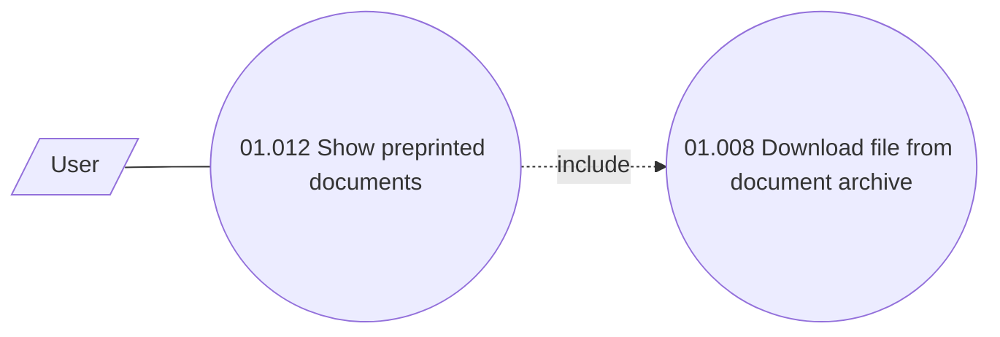

# Use case model

- **Diagram Type**: Use Case
- **Package**: HomerSelect/BSL/Analysis Model/COMMON for BSL/Preprinted documents/Use case model
- **Diagram ID**: 63563
- **Elements**: 3
- **Connectors**: 2

