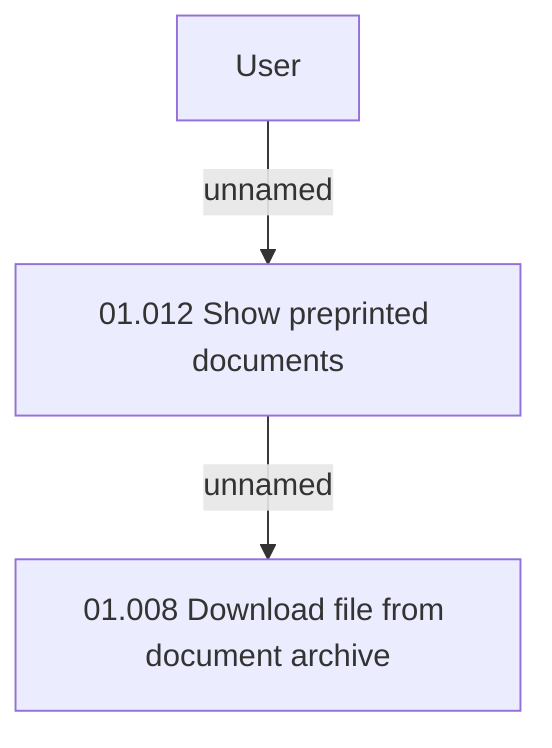

# Use case model

```mermaid
graph TD
    n_01_008_Download_file_from_document_archive["01.008 Download file from document archive"]
    n_01_012_Show_preprinted_documents["01.012 Show preprinted documents"]
    User["User"]
    n_01_012_Show_preprinted_documents -->|unnamed| n_01_008_Download_file_from_document_archive
    User -->|unnamed| n_01_012_Show_preprinted_documents
```
