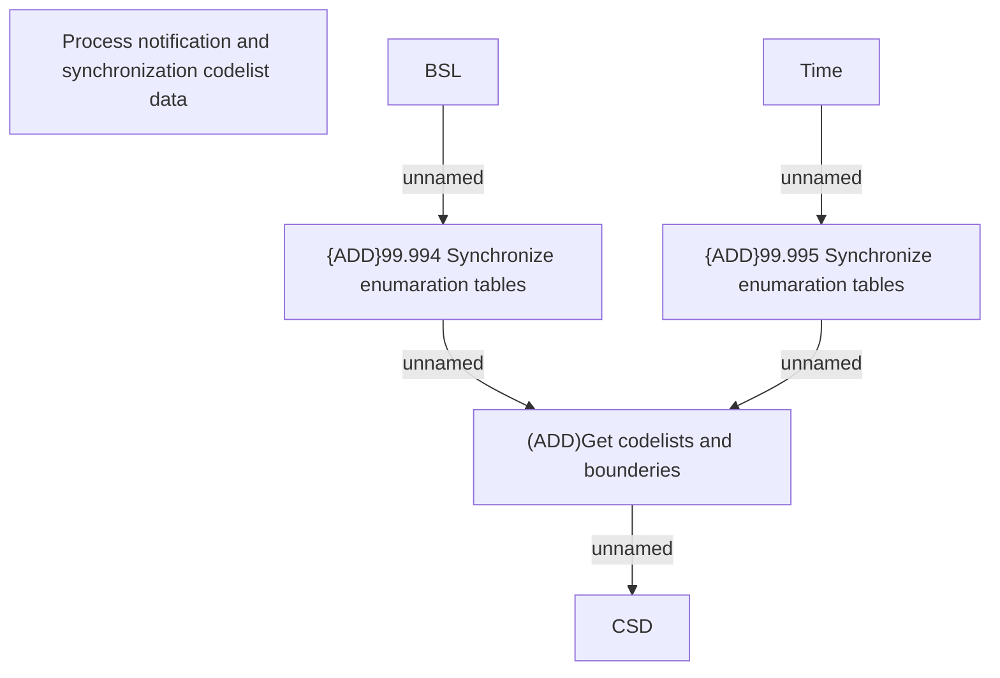

# Use case Model

```mermaid
graph TD
    Process_notification_and_synchronization_codelist_data["Process notification and synchronization codelist data"]
    ADD_Get_codelists_and_bounderies["(ADD)Get codelists and bounderies"]
    BSL["BSL"]
    ADD_99_995_Synchronize_enumaration_tables["{ADD}99.995 Synchronize enumaration tables"]
    Time["Time"]
    CSD["CSD"]
    ADD_99_994_Synchronize_enumaration_tables["{ADD}99.994 Synchronize enumaration tables"]
    ADD_99_994_Synchronize_enumaration_tables -->|unnamed| ADD_Get_codelists_and_bounderies
    ADD_99_995_Synchronize_enumaration_tables -->|unnamed| ADD_Get_codelists_and_bounderies
    ADD_Get_codelists_and_bounderies -->|unnamed| CSD
    Time -->|unnamed| ADD_99_995_Synchronize_enumaration_tables
    BSL -->|unnamed| ADD_99_994_Synchronize_enumaration_tables
```
