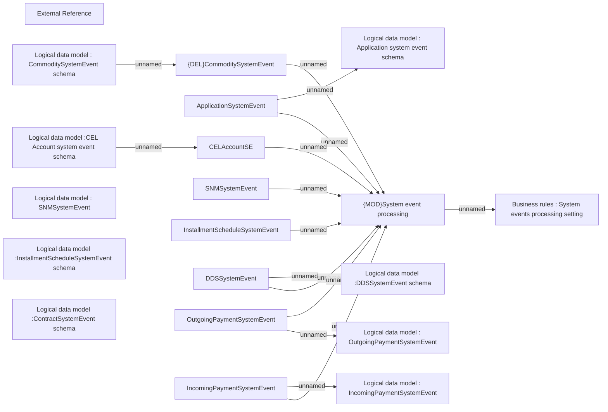

# System events processing

- **Diagram Type**: Use Case
- **Package**: HomerSelect/BSL/Analysis Model/COMMON for BSL/System events/Business rules
- **Diagram ID**: 163442
- **Elements**: 20
- **Connectors**: 15

