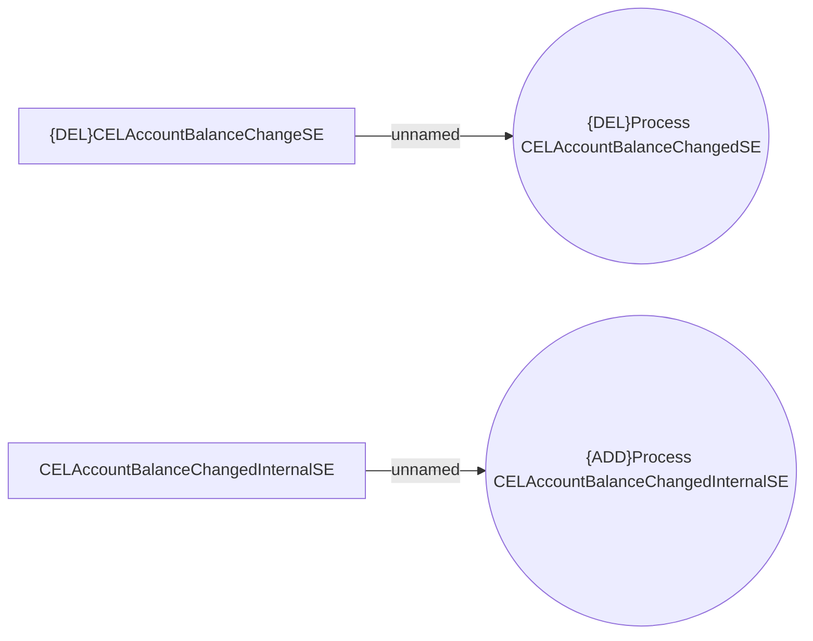

# CEL Account System Events

- **Diagram Type**: Use Case
- **Package**: HomerSelect/BSL/Analysis Model/COMMON for BSL/System events/Use case model/CEL Account System Events
- **Diagram ID**: 163553
- **Elements**: 4
- **Connectors**: 2

