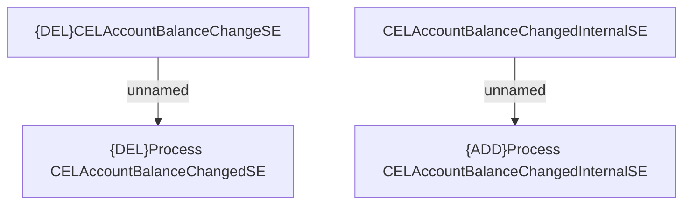

# CEL Account System Events

```mermaid
graph TD
    DEL_Process_CELAccountBalanceChangedSE["{DEL}Process CELAccountBalanceChangedSE"]
    ADD_Process_CELAccountBalanceChangedInternalSE["{ADD}Process CELAccountBalanceChangedInternalSE"]
    DEL_CELAccountBalanceChangeSE["{DEL}CELAccountBalanceChangeSE"]
    CELAccountBalanceChangedInternalSE["CELAccountBalanceChangedInternalSE"]
    CELAccountBalanceChangedInternalSE -->|unnamed| ADD_Process_CELAccountBalanceChangedInternalSE
    DEL_CELAccountBalanceChangeSE -->|unnamed| DEL_Process_CELAccountBalanceChangedSE
```
