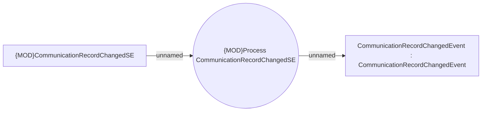

# Communication system events

- **Diagram Type**: Use Case
- **Package**: HomerSelect/BSL/Analysis Model/COMMON for BSL/System events/Use case model/Communication system events
- **Diagram ID**: 141884
- **Elements**: 3
- **Connectors**: 2

