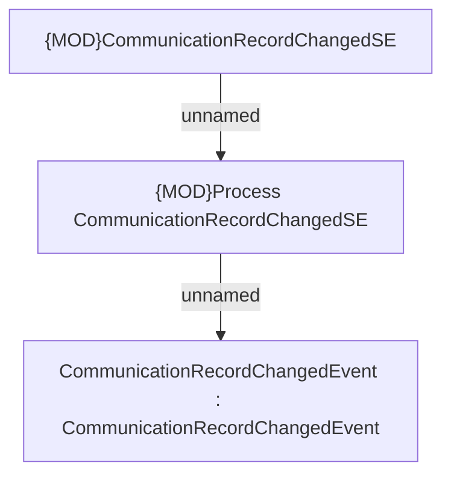

# Communication system events

```mermaid
graph TD
    CommunicationRecordChangedEvent_CommunicationRecordChangedEv["CommunicationRecordChangedEvent : CommunicationRecordChangedEvent"]
    MOD_CommunicationRecordChangedSE["{MOD}CommunicationRecordChangedSE"]
    MOD_Process_CommunicationRecordChangedSE["{MOD}Process CommunicationRecordChangedSE"]
    MOD_Process_CommunicationRecordChangedSE -->|unnamed| CommunicationRecordChangedEvent_CommunicationRecordChangedEv
    MOD_CommunicationRecordChangedSE -->|unnamed| MOD_Process_CommunicationRecordChangedSE
```
