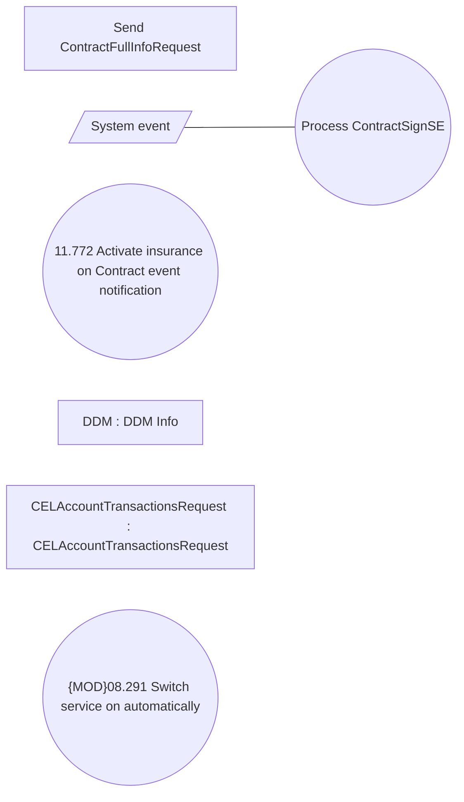

# Processing Contract Signed Event - Use Case Model

- **Diagram Type**: Use Case
- **Package**: HomerSelect/BSL/Analysis Model/COMMON for BSL/System events/Use case model/Contract System Events
- **Diagram ID**: 164588
- **Elements**: 7
- **Connectors**: 1

