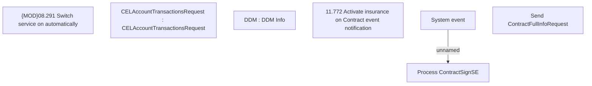

# Processing Contract Signed Event - Use Case Model

```mermaid
graph TD
    Process_ContractSignSE["Process ContractSignSE"]
    MOD_08_291_Switch_service_on_automatically["{MOD}08.291 Switch service on automatically"]
    CELAccountTransactionsRequest_CELAccountTransactionsRequest["CELAccountTransactionsRequest : CELAccountTransactionsRequest"]
    DDM_DDM_Info["DDM : DDM Info"]
    n_11_772_Activate_insurance_on_Contract_event_notification["11.772 Activate insurance on Contract event notification"]
    System_event["System event"]
    Send_ContractFullInfoRequest["Send ContractFullInfoRequest"]
    System_event -->|unnamed| Process_ContractSignSE
```
