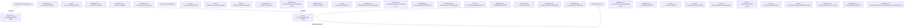

# Processing of ContractSystemEvents

```mermaid
graph TD
    External_Reference["External Reference"]
    ADD_Process_ContractPaidOffSE_IS["{ADD}Process ContractPaidOffSE [IS]"]
    External_Reference["External Reference"]
    External_Reference["External Reference"]
    External_Reference["External Reference"]
    External_Reference["External Reference"]
    Process_ContractSaleRequestedSE["Process ContractSaleRequestedSE"]
    External_Reference["External Reference"]
    MOD_Process_ConditionAcceptedSE["{MOD}Process ConditionAcceptedSE"]
    External_Reference["External Reference"]
    External_Reference["External Reference"]
    External_Reference["External Reference"]
    ADD_Process_PIRRecalculatedSE["{ADD}Process PIRRecalculatedSE"]
    ADD_Process_ContractServiceChangeSE["{ADD}Process ContractServiceChangeSE"]
    Process_ContractSignSE["Process ContractSignSE"]
    Process_ContractPaidOffSE_CLM["Process ContractPaidOffSE [CLM] "]
    Process_POSDisbursementConfirmedSE["Process POSDisbursementConfirmedSE"]
    MOD_Process_ContractRegisteredSE_PAY["{MOD}Process ContractRegisteredSE [PAY]"]
    External_Reference["External Reference"]
    Process_ContractRegisteredSE_CLM["Process ContractRegisteredSE [CLM]"]
    Process_ContractPackageReceivedSE["Process ContractPackageReceivedSE"]
    MOD_Process_ContractActivationSE["{MOD}Process ContractActivationSE"]
    MOD_Process_ContractFinishingAutomaticallySE_CSI["{MOD}Process ContractFinishingAutomaticallySE [CSI]"]
    MOD_Process_ContractIsSoldSE["{MOD}Process ContractIsSoldSE"]
    Process_ContractCancellationSE["Process ContractCancellationSE"]
    External_Reference["External Reference"]
    External_Reference["External Reference"]
    External_Reference["External Reference"]
    ADD_Process_RetailerDisbursementConfirmedSE["{ADD}Process RetailerDisbursementConfirmedSE"]
    External_Reference["External Reference"]
    ADD_Process_ContractFinishingAutomaticallySE_IS["{ADD}Process ContractFinishingAutomaticallySE [IS]"]
    External_Reference["External Reference"]
    MOD_Process_ContractCreditLimitChangedSE["{MOD}Process ContractCreditLimitChangedSE"]
    External_Reference["External Reference"]
    MOD_Process_CashDisbursementConfirmedSE["{MOD}Process CashDisbursementConfirmedSE"]
    Process_ContractRegistrationOutPaySE["Process ContractRegistrationOutPaySE"]
    External_Reference["External Reference"]
    MOD_Process_ContractRegistrationSE["{MOD}Process ContractRegistrationSE"]
    ADD_Process_PaymentHolidaySE["{ADD}Process PaymentHolidaySE"]
    MOD_Process_RepaymentChannelChangedSE["{MOD}Process RepaymentChannelChangedSE"]
    External_Reference["External Reference"]
    MOD_Process_ContractDueDateChangedSE["{MOD}Process ContractDueDateChangedSE"]
    External_Reference["External Reference"]
    MOD_ContractRegisteredSE["{MOD}ContractRegisteredSE"]
    External_Reference["External Reference"]
    External_Reference["External Reference"]
    MOD_Process_ContractFinishingAutomaticallySE_CLM["{MOD}Process ContractFinishingAutomaticallySE [CLM]"]
    MOD_Process_ConditionRejectedSE["{MOD}Process ConditionRejectedSE"]
    Process_ClientIdChangedSE["Process ClientIdChangedSE"]
    External_Reference["External Reference"]
    External_Reference["External Reference"]
    Process_ContractActivationOutPaySE["Process ContractActivationOutPaySE"]
    Process_FullEarlyRepaymentRequestedSE["Process FullEarlyRepaymentRequestedSE"]
    External_Reference["External Reference"]
    External_Reference["External Reference"]
    External_Reference["External Reference"]
    Process_ContractWrittenOffSE_CLM["Process ContractWrittenOffSE [CLM]"]
    Process_ContractWrittenOffSE_IS["Process ContractWrittenOffSE [IS]"]
    Process_ContractServiceEvaluationRequestedSE["Process ContractServiceEvaluationRequestedSE"]
    MOD_Process_LoanServiceRequestExecutedSE["{MOD}Process LoanServiceRequestExecutedSE"]
    External_Reference["External Reference"]
    MOD_Process_PartialEarlyRepaymentSE["{MOD}Process PartialEarlyRepaymentSE"]
    External_Reference["External Reference"]
    ADD_Process_ContractFinishingAutomaticallyOnLoanServiceReque["{ADD}Process ContractFinishingAutomaticallyOnLoanServiceRequestSE"]
    MOD_ContractRegisteredSE -->|unnamed| MOD_Process_ContractRegisteredSE_PAY
    MOD_ContractRegisteredSE -->|unnamed| Process_ContractRegisteredSE_CLM
    External_Reference -->|External Reference| External_Reference
    External_Reference -->|External Reference| External_Reference
```
