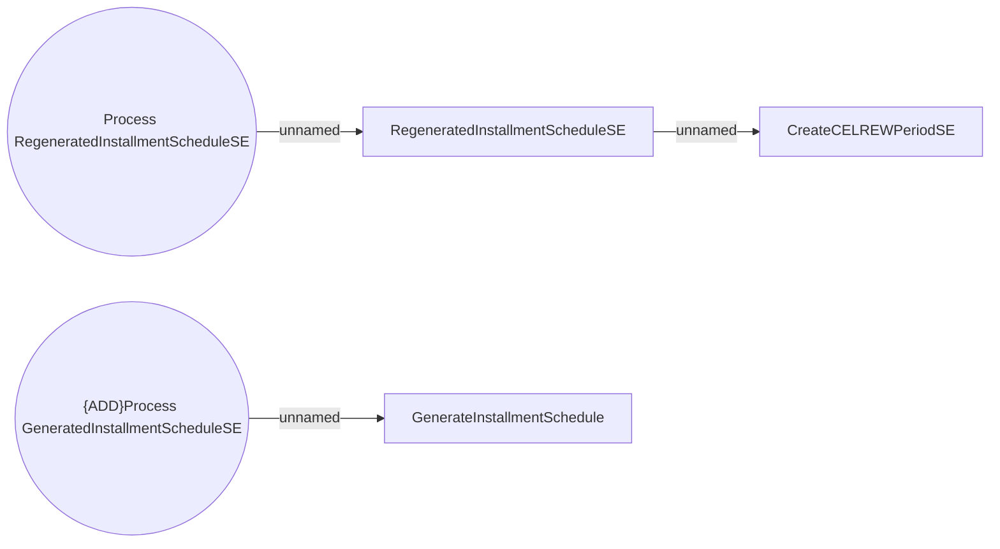

# Installment schedule system events

- **Diagram Type**: Use Case
- **Package**: HomerSelect/BSL/Analysis Model/COMMON for BSL/System events/Use case model/Installment schedule system events
- **Diagram ID**: 163397
- **Elements**: 5
- **Connectors**: 3

