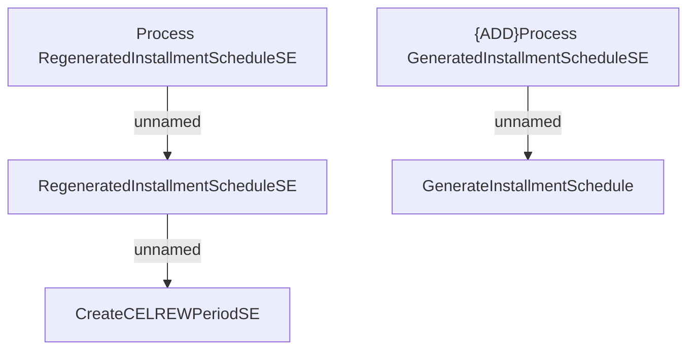

# Installment schedule system events

```mermaid
graph TD
    CreateCELREWPeriodSE["CreateCELREWPeriodSE"]
    Process_RegeneratedInstallmentScheduleSE["Process RegeneratedInstallmentScheduleSE"]
    RegeneratedInstallmentScheduleSE["RegeneratedInstallmentScheduleSE"]
    ADD_Process_GeneratedInstallmentScheduleSE["{ADD}Process GeneratedInstallmentScheduleSE"]
    GenerateInstallmentSchedule["GenerateInstallmentSchedule"]
    ADD_Process_GeneratedInstallmentScheduleSE -->|unnamed| GenerateInstallmentSchedule
    Process_RegeneratedInstallmentScheduleSE -->|unnamed| RegeneratedInstallmentScheduleSE
    RegeneratedInstallmentScheduleSE -->|unnamed| CreateCELREWPeriodSE
```
