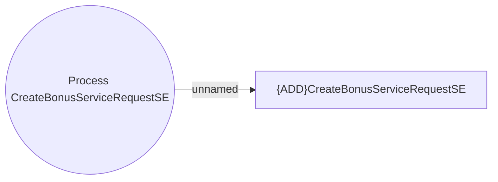

# Other system events

- **Diagram Type**: Use Case
- **Package**: HomerSelect/BSL/Analysis Model/COMMON for BSL/System events/Use case model/Other system events
- **Diagram ID**: 163584
- **Elements**: 2
- **Connectors**: 1

