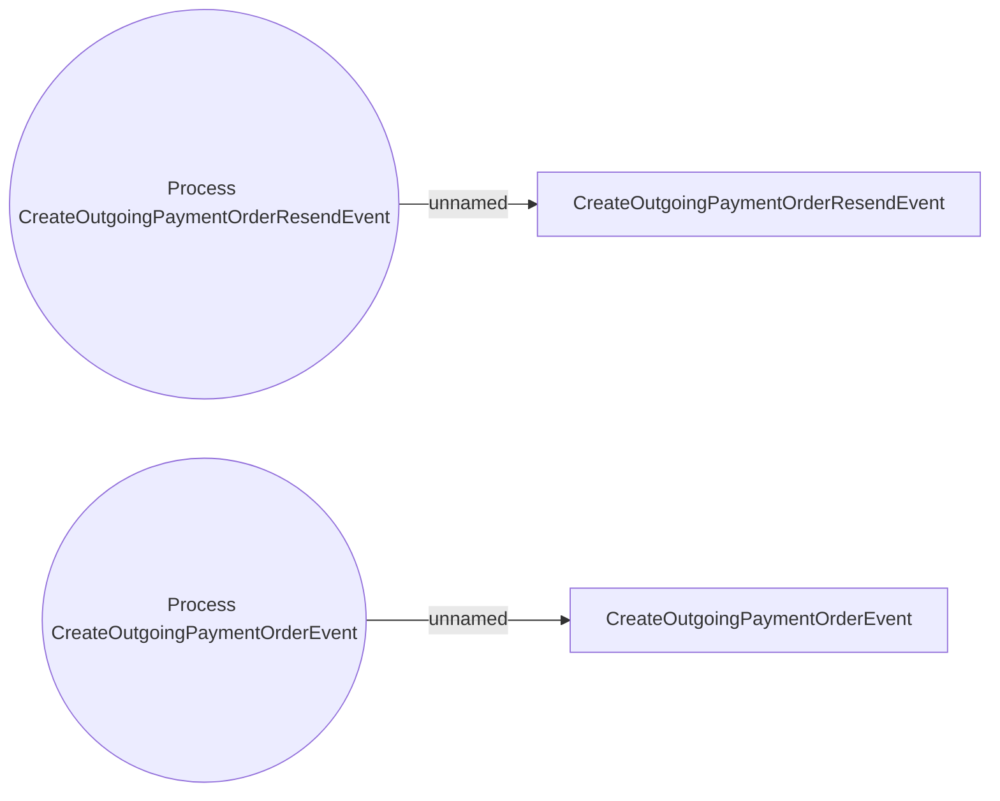

# Outgoing payment system events

- **Diagram Type**: Use Case
- **Package**: HomerSelect/BSL/Analysis Model/COMMON for BSL/System events/Use case model/Outgoing payment system events
- **Diagram ID**: 164522
- **Elements**: 4
- **Connectors**: 2

