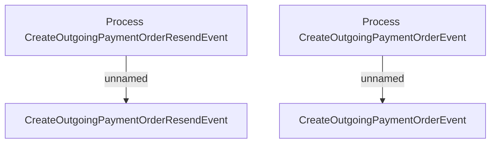

# Outgoing payment system events

```mermaid
graph TD
    Process_CreateOutgoingPaymentOrderResendEvent["Process CreateOutgoingPaymentOrderResendEvent"]
    CreateOutgoingPaymentOrderResendEvent["CreateOutgoingPaymentOrderResendEvent"]
    Process_CreateOutgoingPaymentOrderEvent["Process CreateOutgoingPaymentOrderEvent"]
    CreateOutgoingPaymentOrderEvent["CreateOutgoingPaymentOrderEvent"]
    Process_CreateOutgoingPaymentOrderEvent -->|unnamed| CreateOutgoingPaymentOrderEvent
    Process_CreateOutgoingPaymentOrderResendEvent -->|unnamed| CreateOutgoingPaymentOrderResendEvent
```
