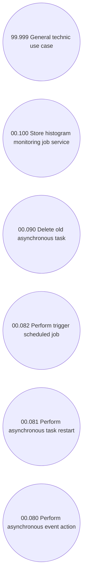

# Technical support

- **Diagram Type**: Use Case
- **Package**: HomerSelect/BSL/Analysis Model/COMMON for BSL/Technical support/Use case
- **Diagram ID**: 46428
- **Elements**: 6
- **Connectors**: 0

