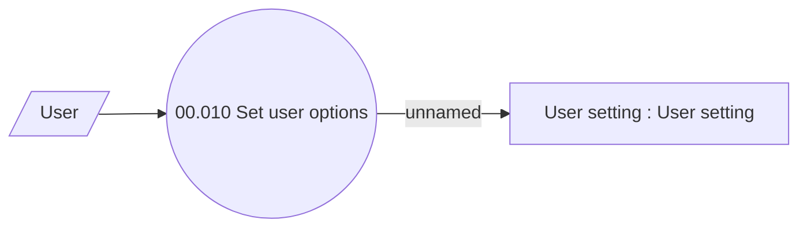

# User settings

- **Diagram Type**: Use Case
- **Package**: HomerSelect/BSL/Analysis Model/COMMON for BSL/User settings/Use Case
- **Diagram ID**: 148623
- **Elements**: 3
- **Connectors**: 2

```mermaid
graph LR
    User_setting_User_setting["User setting : User setting"]
    User[/"User"/]
    n_00_010_Set_user_options(("00.010 Set user options"))
    n_00_010_Set_user_options -->|unnamed| User_setting_User_setting
    User --> n_00_010_Set_user_options
```
