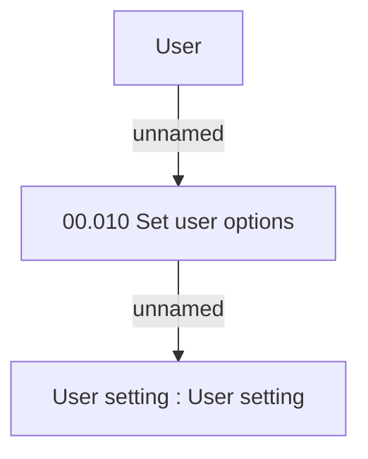

# User settings

```mermaid
graph TD
    User_setting_User_setting["User setting : User setting"]
    User["User"]
    n_00_010_Set_user_options["00.010 Set user options"]
    n_00_010_Set_user_options -->|unnamed| User_setting_User_setting
    User -->|unnamed| n_00_010_Set_user_options
```
