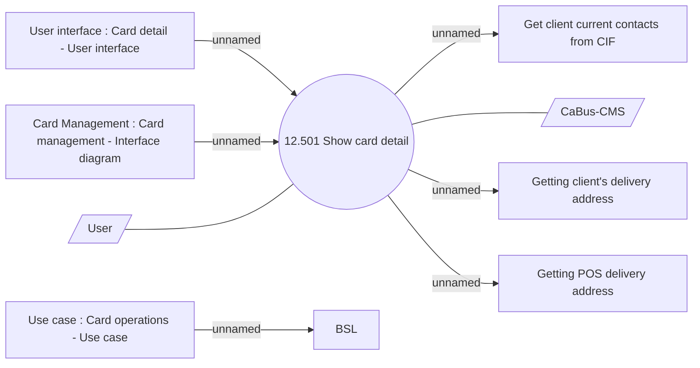

# Card detail - Use case

- **Diagram Type**: Use Case
- **Package**: HomerSelect/BSL/Analysis Model/Card management support/Card detail/Use case
- **Diagram ID**: 138402
- **Elements**: 10
- **Connectors**: 8

