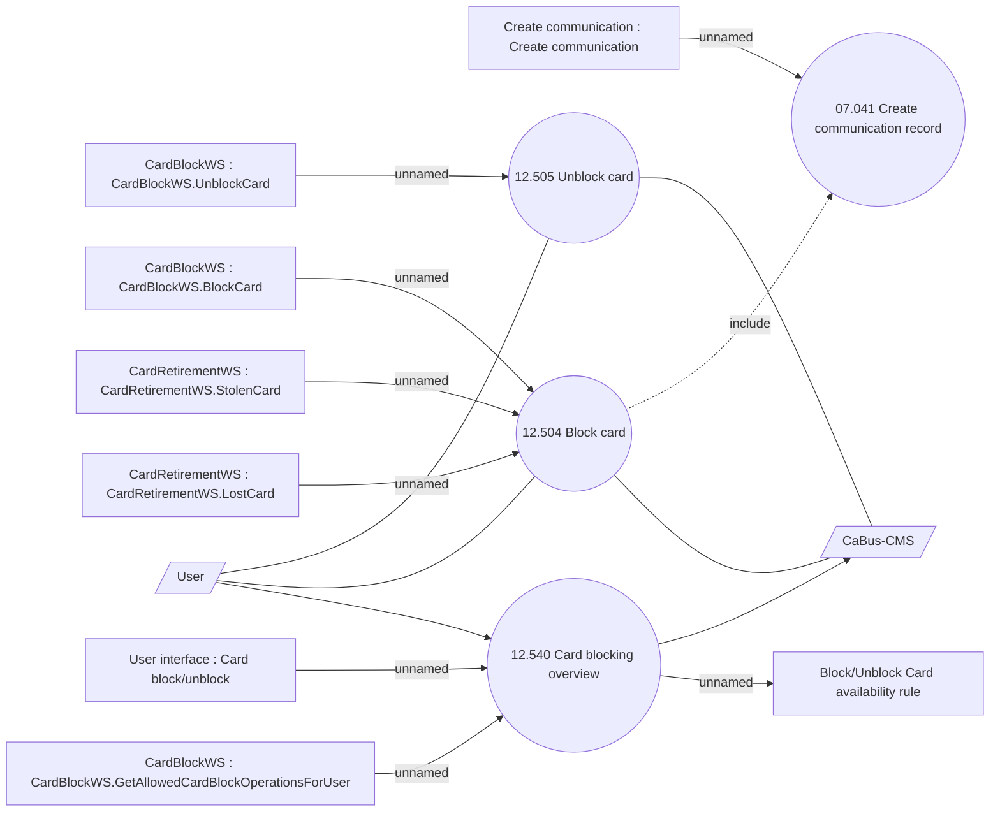

# Blocking & Unblocking card

- **Diagram Type**: Use Case
- **Package**: HomerSelect/BSL/Analysis Model/Card management support/Card operations/Use case
- **Diagram ID**: 161440
- **Elements**: 14
- **Connectors**: 15

