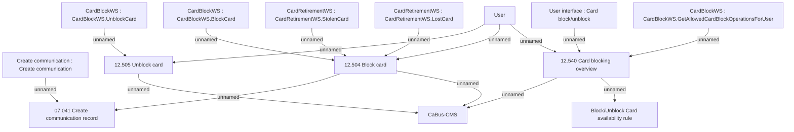

# Blocking & Unblocking card

```mermaid
graph TD
    Create_communication_Create_communication["Create communication : Create communication"]
    n_07_041_Create_communication_record["07.041 Create communication record"]
    CardBlockWS_CardBlockWS_UnblockCard["CardBlockWS : CardBlockWS.UnblockCard"]
    CardBlockWS_CardBlockWS_BlockCard["CardBlockWS : CardBlockWS.BlockCard"]
    CardRetirementWS_CardRetirementWS_StolenCard["CardRetirementWS : CardRetirementWS.StolenCard"]
    CardRetirementWS_CardRetirementWS_LostCard["CardRetirementWS : CardRetirementWS.LostCard"]
    CardBlockWS_CardBlockWS_GetAllowedCardBlockOperationsForUser["CardBlockWS : CardBlockWS.GetAllowedCardBlockOperationsForUser"]
    Block_Unblock_Card_availability_rule["Block/Unblock Card availability rule"]
    CaBus_CMS["CaBus-CMS"]
    User_interface_Card_block_unblock["User interface : Card block/unblock"]
    n_12_540_Card_blocking_overview["12.540 Card blocking overview"]
    User["User"]
    n_12_505_Unblock_card["12.505 Unblock card"]
    n_12_504_Block_card["12.504 Block card"]
    Create_communication_Create_communication -->|unnamed| n_07_041_Create_communication_record
    n_12_504_Block_card -->|unnamed| n_07_041_Create_communication_record
    CardBlockWS_CardBlockWS_BlockCard -->|unnamed| n_12_504_Block_card
    CardRetirementWS_CardRetirementWS_StolenCard -->|unnamed| n_12_504_Block_card
    CardRetirementWS_CardRetirementWS_LostCard -->|unnamed| n_12_504_Block_card
    CardBlockWS_CardBlockWS_UnblockCard -->|unnamed| n_12_505_Unblock_card
    User_interface_Card_block_unblock -->|unnamed| n_12_540_Card_blocking_overview
    CardBlockWS_CardBlockWS_GetAllowedCardBlockOperationsForUser -->|unnamed| n_12_540_Card_blocking_overview
    n_12_505_Unblock_card -->|unnamed| CaBus_CMS
    n_12_540_Card_blocking_overview -->|unnamed| CaBus_CMS
    n_12_504_Block_card -->|unnamed| CaBus_CMS
    n_12_540_Card_blocking_overview -->|unnamed| Block_Unblock_Card_availability_rule
    User -->|unnamed| n_12_505_Unblock_card
    User -->|unnamed| n_12_504_Block_card
    User -->|unnamed| n_12_540_Card_blocking_overview
```
