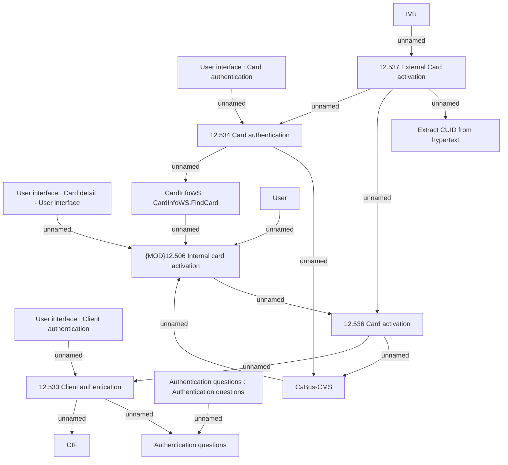

# Card activation

```mermaid
graph TD
    User_interface_Card_detail_User_interface["User interface : Card detail - User interface"]
    CardInfoWS_CardInfoWS_FindCard["CardInfoWS : CardInfoWS.FindCard"]
    CaBus_CMS["CaBus-CMS"]
    Authentication_questions_Authentication_questions["Authentication questions : Authentication questions"]
    User_interface_Client_authentication["User interface : Client authentication"]
    User_interface_Card_authentication["User interface : Card authentication"]
    Authentication_questions["Authentication questions"]
    Extract_CUID_from_hypertext["Extract CUID from hypertext"]
    MOD_12_506_Internal_card_activation["{MOD}12.506 Internal card activation"]
    n_12_536_Card_activation["12.536 Card activation"]
    n_12_537_External_Card_activation["12.537 External Card activation"]
    n_12_534_Card_authentication["12.534 Card authentication"]
    n_12_533_Client_authentication["12.533 Client authentication"]
    CIF["CIF"]
    IVR["IVR"]
    User["User"]
    User_interface_Card_detail_User_interface -->|unnamed| MOD_12_506_Internal_card_activation
    n_12_534_Card_authentication -->|unnamed| CaBus_CMS
    n_12_536_Card_activation -->|unnamed| CaBus_CMS
    Authentication_questions_Authentication_questions -->|unnamed| Authentication_questions
    n_12_533_Client_authentication -->|unnamed| Authentication_questions
    n_12_537_External_Card_activation -->|unnamed| Extract_CUID_from_hypertext
    CardInfoWS_CardInfoWS_FindCard -->|unnamed| MOD_12_506_Internal_card_activation
    n_12_534_Card_authentication -->|unnamed| CardInfoWS_CardInfoWS_FindCard
    n_12_533_Client_authentication -->|unnamed| CIF
    n_12_537_External_Card_activation -->|unnamed| n_12_536_Card_activation
    MOD_12_506_Internal_card_activation -->|unnamed| n_12_536_Card_activation
    n_12_537_External_Card_activation -->|unnamed| n_12_534_Card_authentication
    User_interface_Card_authentication -->|unnamed| n_12_534_Card_authentication
    User_interface_Client_authentication -->|unnamed| n_12_533_Client_authentication
    n_12_536_Card_activation -->|unnamed| n_12_533_Client_authentication
    IVR -->|unnamed| n_12_537_External_Card_activation
    CaBus_CMS -->|unnamed| MOD_12_506_Internal_card_activation
    User -->|unnamed| MOD_12_506_Internal_card_activation
```
