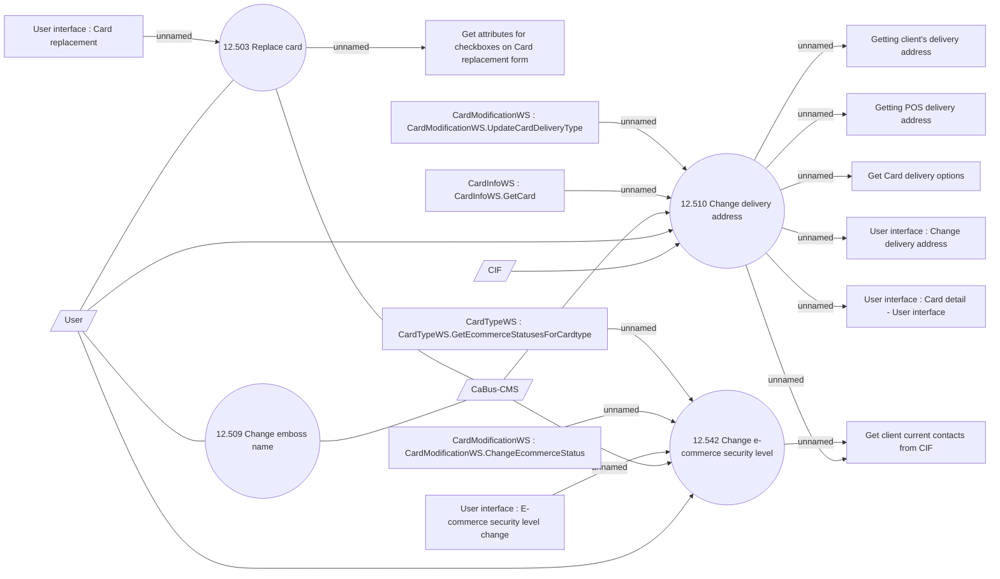

# Other Card operations - Use case

- **Diagram Type**: Use Case
- **Package**: HomerSelect/BSL/Analysis Model/Card management support/Card operations/Use case
- **Diagram ID**: 161441
- **Elements**: 20
- **Connectors**: 23

