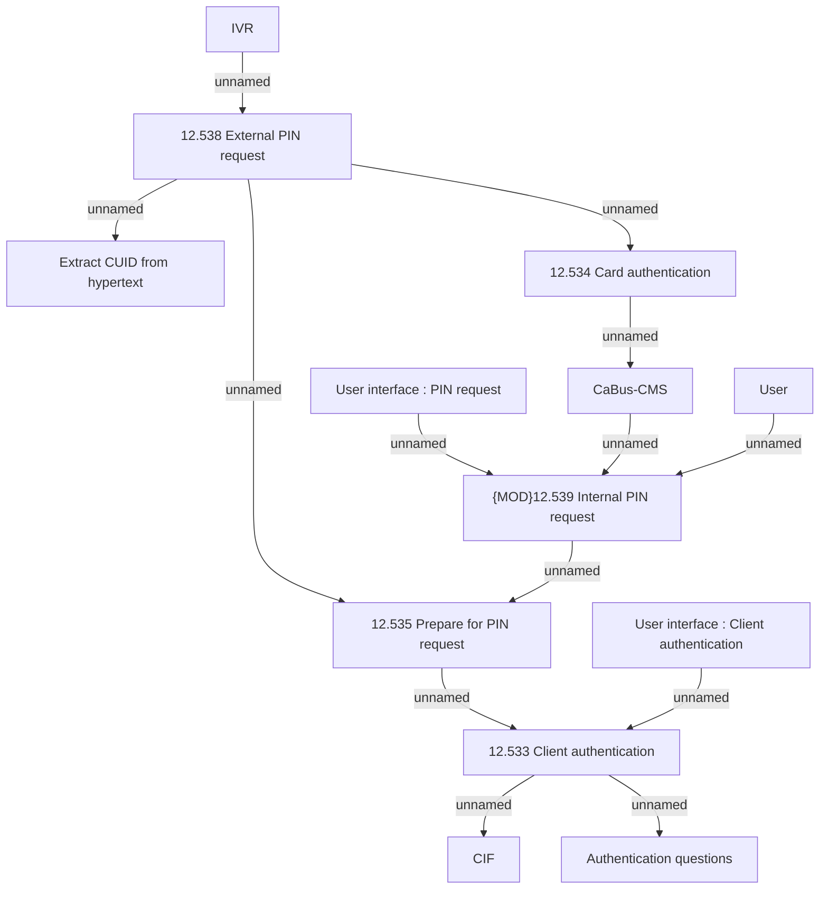

# PIN request

```mermaid
graph TD
    CaBus_CMS["CaBus-CMS"]
    User_interface_Client_authentication["User interface : Client authentication"]
    Authentication_questions["Authentication questions"]
    User_interface_PIN_request["User interface : PIN request"]
    Extract_CUID_from_hypertext["Extract CUID from hypertext"]
    n_12_534_Card_authentication["12.534 Card authentication"]
    n_12_533_Client_authentication["12.533 Client authentication"]
    MOD_12_539_Internal_PIN_request["{MOD}12.539 Internal PIN request"]
    n_12_538_External_PIN_request["12.538 External PIN request"]
    n_12_535_Prepare_for_PIN_request["12.535 Prepare for PIN request"]
    CIF["CIF"]
    IVR["IVR"]
    User["User"]
    n_12_533_Client_authentication -->|unnamed| CIF
    n_12_538_External_PIN_request -->|unnamed| n_12_535_Prepare_for_PIN_request
    MOD_12_539_Internal_PIN_request -->|unnamed| n_12_535_Prepare_for_PIN_request
    User_interface_PIN_request -->|unnamed| MOD_12_539_Internal_PIN_request
    n_12_535_Prepare_for_PIN_request -->|unnamed| n_12_533_Client_authentication
    User_interface_Client_authentication -->|unnamed| n_12_533_Client_authentication
    n_12_538_External_PIN_request -->|unnamed| n_12_534_Card_authentication
    n_12_538_External_PIN_request -->|unnamed| Extract_CUID_from_hypertext
    n_12_533_Client_authentication -->|unnamed| Authentication_questions
    n_12_534_Card_authentication -->|unnamed| CaBus_CMS
    IVR -->|unnamed| n_12_538_External_PIN_request
    CaBus_CMS -->|unnamed| MOD_12_539_Internal_PIN_request
    User -->|unnamed| MOD_12_539_Internal_PIN_request
```
