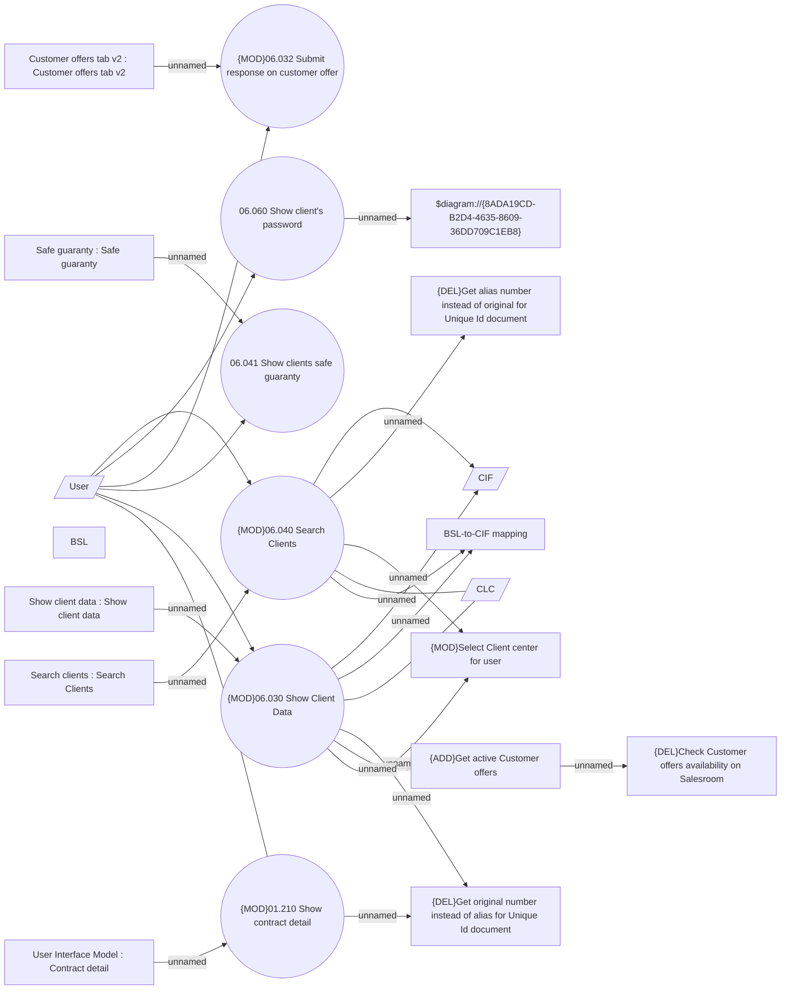

# Client management

- **Diagram Type**: Use Case
- **Package**: HomerSelect/BSL/Analysis Model/Client Management/Client center/UseCase Model
- **Diagram ID**: 157656
- **Elements**: 22
- **Connectors**: 25

