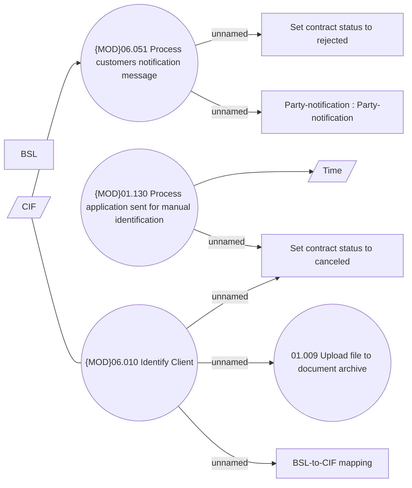

# Client identification

- **Diagram Type**: Use Case
- **Package**: HomerSelect/BSL/Analysis Model/Client Management/Client identification/Use Case
- **Diagram ID**: 157640
- **Elements**: 11
- **Connectors**: 9

