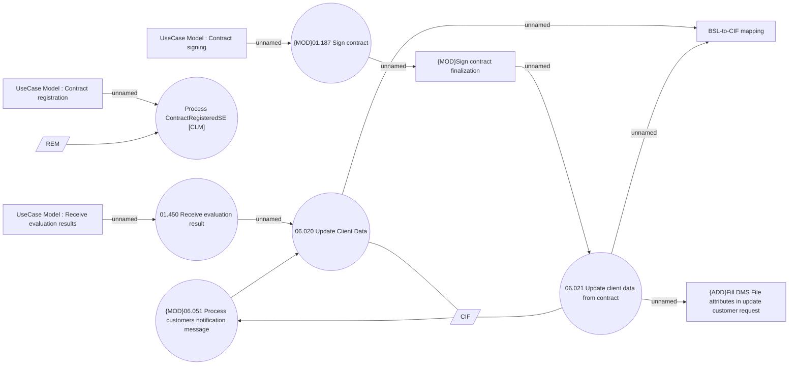

# Client update

- **Diagram Type**: Use Case
- **Package**: HomerSelect/BSL/Analysis Model/Client Management/Client update/Use Case
- **Diagram ID**: 164404
- **Elements**: 14
- **Connectors**: 14

