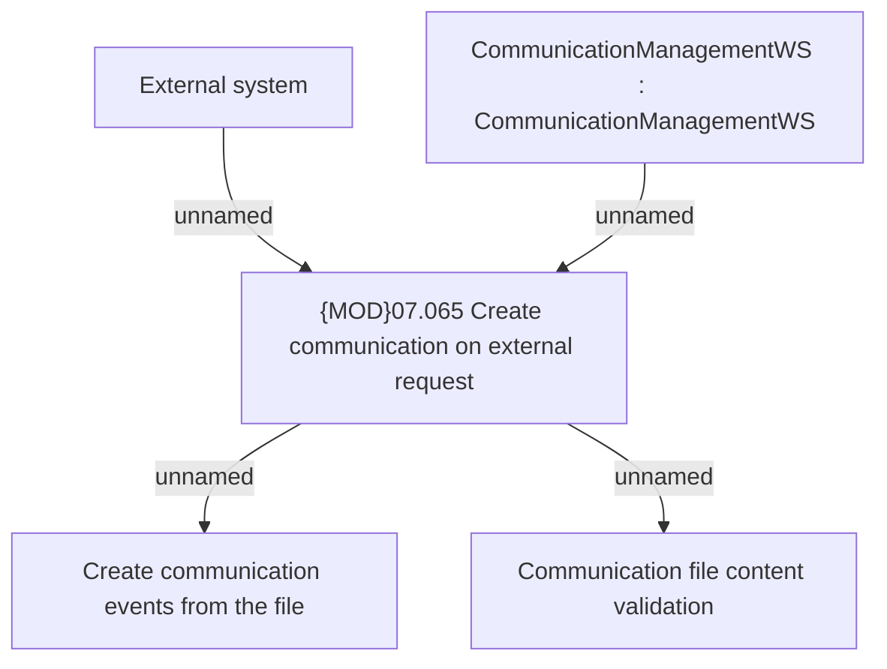

# Create communication on external request

```mermaid
graph TD
    Create_communication_events_from_the_file["Create communication events from the file"]
    Communication_file_content_validation["Communication file content validation"]
    CommunicationManagementWS_CommunicationManagementWS["CommunicationManagementWS : CommunicationManagementWS"]
    External_system["External system"]
    MOD_07_065_Create_communication_on_external_request["{MOD}07.065 Create communication on external request"]
    External_system -->|unnamed| MOD_07_065_Create_communication_on_external_request
    MOD_07_065_Create_communication_on_external_request -->|unnamed| Create_communication_events_from_the_file
    MOD_07_065_Create_communication_on_external_request -->|unnamed| Communication_file_content_validation
    CommunicationManagementWS_CommunicationManagementWS -->|unnamed| MOD_07_065_Create_communication_on_external_request
```
