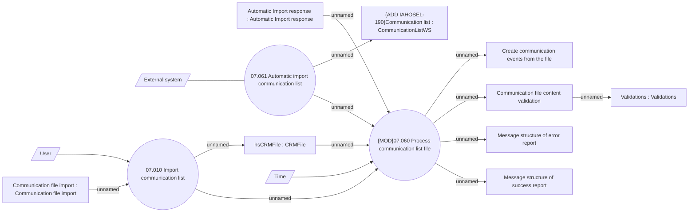

# Import list of communication

- **Diagram Type**: Use Case
- **Package**: HomerSelect/BSL/Analysis Model/Client Management/Communication/Import list of communication/Use Case
- **Diagram ID**: 152145
- **Elements**: 15
- **Connectors**: 15

