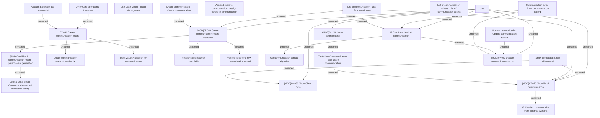

# Communication records

```mermaid
graph TD
    Logical_Data_Model_Communication_record_notification_setting["Logical Data Model :Communication record notification setting"]
    ADD_Condition_for_communication_record_system_event_generati["{ADD}Condition for communication record system event generation"]
    Account_Blockage_use_case_model["Account Blockage use case model"]
    Other_Card_operations_Use_case["Other Card operations - Use case"]
    Create_communication_events_from_the_file["Create communication events from the file"]
    Input_values_validation_for_communications["Input values validation for communications"]
    n_07_041_Create_communication_record["07.041 Create communication record"]
    Use_Case_Model_Ticket_Management["Use Case Model : Ticket Management"]
    n_07_130_Get_communication_from_external_systems["07.130 Get communication from external systems"]
    List_of_communication_List_of_communication["List of communication : List of communication"]
    Assign_tickets_to_communication_Assign_tickets_to_communicat["Assign tickets to communication : Assign tickets to communication"]
    Relationships_between_form_fields["Relationships between form fields"]
    Update_communication_Update_communication_record["Update communication :Update communication record"]
    Create_communication_Create_communication["Create communication : Create communication"]
    Prefilled_fields_for_a_new_communication_record["Prefilled fields for a new communication record"]
    List_of_communication_tickets_List_of_communication_tickets["List of communication tickets : List of communication tickets"]
    Communication_detail_Show_communication_record["Communication detail :Show communication record"]
    Get_communication_contact_algorithm["Get communication contact algorithm"]
    Tab8_List_of_communication_Tab8_List_of_communication["Tab8-List of communication : Tab8-List of communication"]
    Show_client_data_Show_client_detail["Show client data :Show client detail"]
    User["User"]
    MOD_01_210_Show_contract_detail["{MOD}01.210 Show contract detail"]
    MOD_06_030_Show_Client_Data["{MOD}06.030 Show Client Data"]
    MOD_07_050_Update_communication_record["{MOD}07.050 Update communication record"]
    MOD_07_040_Create_communication_record_manually["{MOD}07.040 Create communication record manually"]
    n_07_030_Show_detail_of_communication["07.030 Show detail of communication"]
    MOD_07_020_Show_list_of_communication["{MOD}07.020 Show list of communication"]
    Communication_detail_Show_communication_record -->|unnamed| MOD_07_050_Update_communication_record
    MOD_07_040_Create_communication_record_manually -->|unnamed| ADD_Condition_for_communication_record_system_event_generati
    n_07_041_Create_communication_record -->|unnamed| Create_communication_events_from_the_file
    n_07_041_Create_communication_record -->|unnamed| Input_values_validation_for_communications
    Account_Blockage_use_case_model -->|unnamed| n_07_041_Create_communication_record
    Other_Card_operations_Use_case -->|unnamed| n_07_041_Create_communication_record
    MOD_07_020_Show_list_of_communication -->|unnamed| n_07_130_Get_communication_from_external_systems
    MOD_07_040_Create_communication_record_manually -->|unnamed| Relationships_between_form_fields
    MOD_07_040_Create_communication_record_manually -->|unnamed| Prefilled_fields_for_a_new_communication_record
    n_07_030_Show_detail_of_communication -->|unnamed| Get_communication_contact_algorithm
    MOD_01_210_Show_contract_detail -->|unnamed| Tab8_List_of_communication_Tab8_List_of_communication
    ADD_Condition_for_communication_record_system_event_generati -->|unnamed| Logical_Data_Model_Communication_record_notification_setting
    Tab8_List_of_communication_Tab8_List_of_communication -->|unnamed| MOD_07_020_Show_list_of_communication
    n_07_030_Show_detail_of_communication -->|unnamed| MOD_07_050_Update_communication_record
    Update_communication_Update_communication_record -->|unnamed| MOD_07_050_Update_communication_record
    Create_communication_Create_communication -->|unnamed| MOD_07_040_Create_communication_record_manually
    List_of_communication_List_of_communication -->|unnamed| MOD_07_040_Create_communication_record_manually
    List_of_communication_List_of_communication -->|unnamed| n_07_030_Show_detail_of_communication
    Communication_detail_Show_communication_record -->|unnamed| n_07_030_Show_detail_of_communication
    List_of_communication_List_of_communication -->|unnamed| MOD_07_020_Show_list_of_communication
    Show_client_data_Show_client_detail -->|unnamed| MOD_07_020_Show_list_of_communication
    Show_client_data_Show_client_detail -->|unnamed| MOD_06_030_Show_Client_Data
    User -->|unnamed| MOD_07_050_Update_communication_record
    User -->|unnamed| MOD_01_210_Show_contract_detail
    User -->|unnamed| MOD_06_030_Show_Client_Data
    User -->|unnamed| MOD_07_040_Create_communication_record_manually
    User -->|unnamed| MOD_07_020_Show_list_of_communication
    User -->|unnamed| n_07_030_Show_detail_of_communication
```
