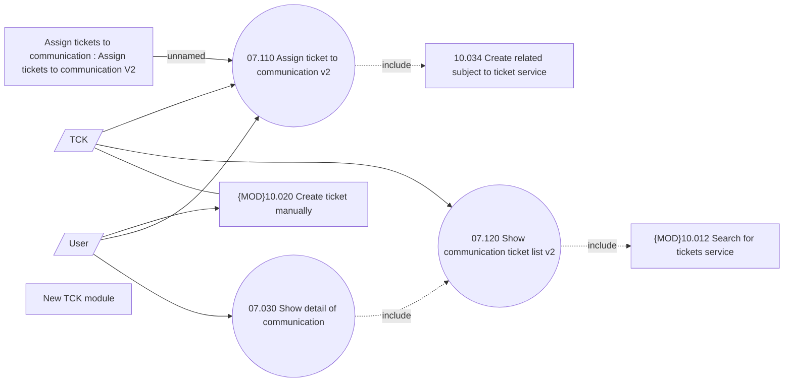

# Manage communication tickets - Use Case

- **Diagram Type**: Use Case
- **Package**: HomerSelect/BSL/Analysis Model/Client Management/Communication/Manage communication/Use Case
- **Diagram ID**: 164534
- **Elements**: 10
- **Connectors**: 10

