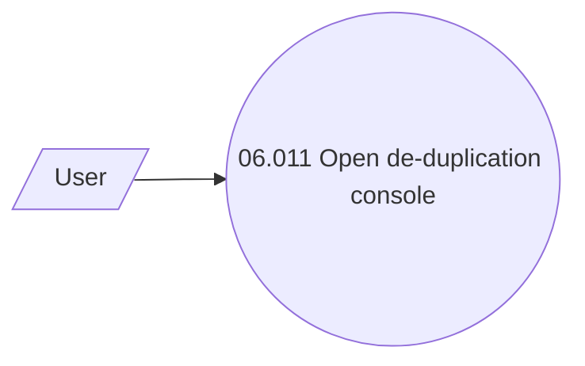

# Client deduplication solving

- **Diagram Type**: Use Case
- **Package**: HomerSelect/BSL/Analysis Model/Client Management/De-duplication/UseCase Model
- **Diagram ID**: 64108
- **Elements**: 2
- **Connectors**: 1

