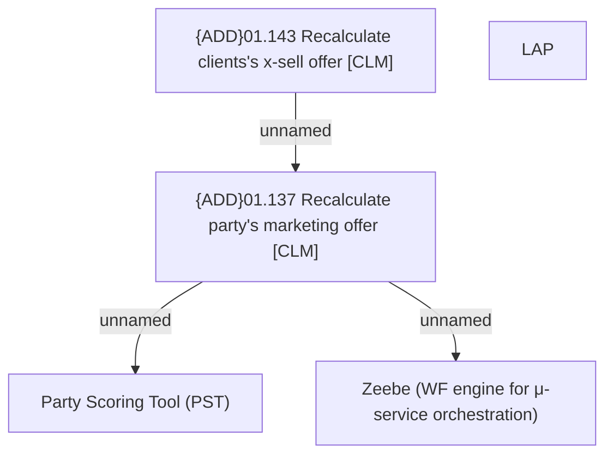

# Offer management

```mermaid
graph TD
    Zeebe_WF_engine_for_service_orchestration["Zeebe (WF engine for μ-service orchestration)"]
    Party_Scoring_Tool_PST["Party Scoring Tool (PST)"]
    ADD_01_143_Recalculate_clients_s_x_sell_offer_CLM["{ADD}01.143 Recalculate clients's x-sell offer [CLM]"]
    ADD_01_137_Recalculate_party_s_marketing_offer_CLM["{ADD}01.137 Recalculate party's marketing offer [CLM]"]
    LAP["LAP"]
    ADD_01_143_Recalculate_clients_s_x_sell_offer_CLM -->|unnamed| ADD_01_137_Recalculate_party_s_marketing_offer_CLM
    ADD_01_137_Recalculate_party_s_marketing_offer_CLM -->|unnamed| Party_Scoring_Tool_PST
    ADD_01_137_Recalculate_party_s_marketing_offer_CLM -->|unnamed| Zeebe_WF_engine_for_service_orchestration
```
