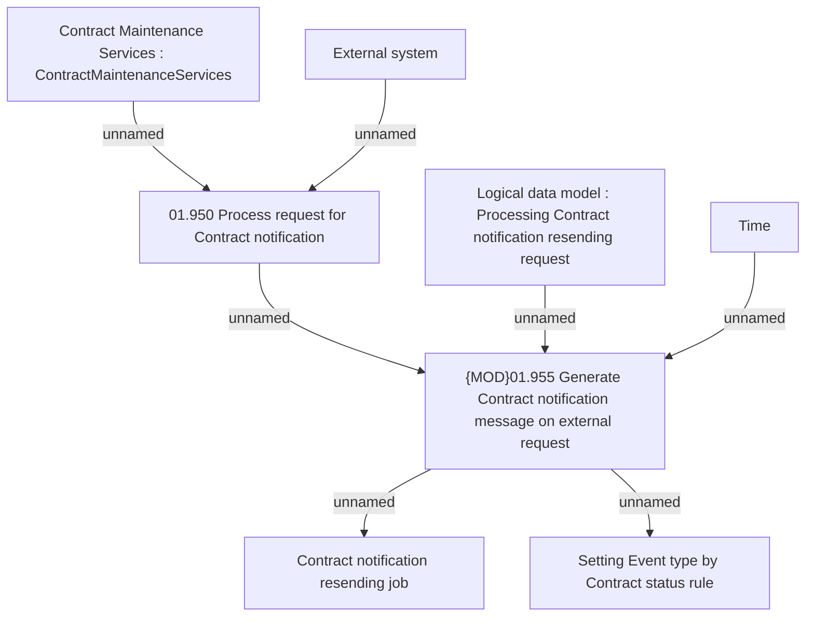

# Sending Contract notification on request

```mermaid
graph TD
    Setting_Event_type_by_Contract_status_rule["Setting Event type by Contract status rule"]
    Contract_notification_resending_job["Contract notification resending job"]
    Logical_data_model_Processing_Contract_notification_resendin["Logical data model : Processing Contract notification resending request"]
    Contract_Maintenance_Services_ContractMaintenanceServices["Contract Maintenance Services : ContractMaintenanceServices"]
    Time["Time"]
    External_system["External system"]
    n_01_950_Process_request_for_Contract_notification["01.950 Process request for Contract notification"]
    MOD_01_955_Generate_Contract_notification_message_on_externa["{MOD}01.955 Generate Contract notification message on external request"]
    n_01_950_Process_request_for_Contract_notification -->|unnamed| MOD_01_955_Generate_Contract_notification_message_on_externa
    Logical_data_model_Processing_Contract_notification_resendin -->|unnamed| MOD_01_955_Generate_Contract_notification_message_on_externa
    Contract_Maintenance_Services_ContractMaintenanceServices -->|unnamed| n_01_950_Process_request_for_Contract_notification
    MOD_01_955_Generate_Contract_notification_message_on_externa -->|unnamed| Contract_notification_resending_job
    MOD_01_955_Generate_Contract_notification_message_on_externa -->|unnamed| Setting_Event_type_by_Contract_status_rule
    External_system -->|unnamed| n_01_950_Process_request_for_Contract_notification
    Time -->|unnamed| MOD_01_955_Generate_Contract_notification_message_on_externa
```
