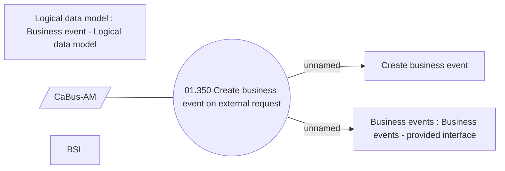

# Create business event on external request

- **Diagram Type**: Use Case
- **Package**: HomerSelect/BSL/Analysis Model/Contract Management/Business events/Use case model
- **Diagram ID**: 159738
- **Elements**: 6
- **Connectors**: 3

